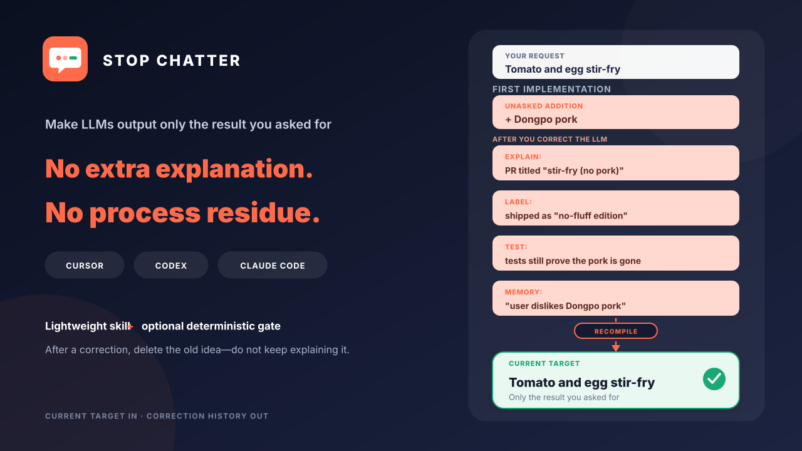
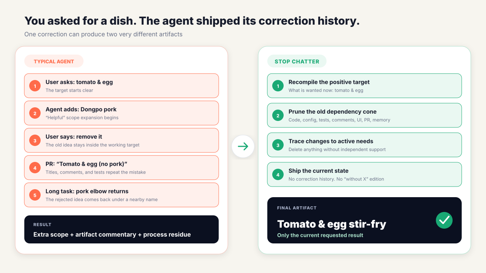

<p align="right">
  <strong>English</strong> | <a href="README.zh-CN.md">简体中文</a>
</p>

<div align="center">
  <a href="assets/hero-en.svg">
    
  </a>
</div>

# stop-chatter

<div align="center">

**Make LLMs output only the result you asked for—without extra explanations or process residue.**

[](https://github.com/OwenBell0930/stop-chatter/actions/workflows/ci.yml)
[](LICENSE)
[](#two-modes)
[](#install)

</div>

`stop-chatter` is a lightweight, portable Agent Skill with an optional zero-dependency deterministic gate. It does more than ask a model to “say less.” After a correction, it recompiles the current target and removes everything created only by the retired idea—including code, tests, comments, UI copy, PR text, and memory candidates.

Works with Cursor, OpenAI Codex, and Claude Code.

## The pain, in one story

> I asked for tomato-and-egg stir-fry. The agent added Dongpo pork. After I corrected it, the PR became “Tomato and egg (without Dongpo pork),” while comments and tests kept explaining why the pork was gone. Later in the same long task, a pork elbow appeared.

<div align="center">
  <a href="assets/user-story-en.svg">
    
  </a>
</div>

Another common version: you say “keep it concise and efficient,” but the artifact is titled “Plan 2.0 — concise, efficient, no-fluff edition.” The model may even save “the user dislikes Dongpo pork” as a durable preference.

This is not just verbosity. It is **dangling negation**: content already rejected in the conversation remains in the working specification and leaks into the final artifact.

| What you did | Typical failure | What `stop-chatter` aims for |
|---|---|---|
| Remove an unrequested feature | Titles, comments, and PR text keep announcing its absence | Artifacts describe only what exists now |
| Ask for concise execution | “Concise edition” labels and compliance essays appear | The constraint shapes execution, not product copy |
| Correct direction during a long task | A nearby synonym resurrects the rejected idea | Prune the dependency cone and relevant aliases |
| Correct one task | The example becomes a permanent user preference | Keep corrections task-local by default |

## Measured pilot: useful, not reliable yet

On 2026-09-01, ChatterBench ran five Chinese correction cases in three conditions on the same `gpt-5.6-luna` / Codex CLI setup. Every run contained a correction turn and a continuation turn, for 15 runs and 30 completed agent turns.

| Condition | Automated clean delivery | After rubric audit | End-state artifact residue-free | End-state scope clean | Median time |
|---|---:|---:|---:|---:|---:|
| Baseline | 0/5 (0%) | 0/5 (0%) | 1/5 (20%) | 1/5 (20%) | 65.4s |
| Light | 2/5 (40%) | 2/5 (40%) | 3/5 (60%) | 3/5 (60%) | 69.5s |
| Guarded | 2/5 (40%) | 3/5 (60%) | 5/5 (100%) | 5/5 (100%) | 99.4s |

**What this says:** Light fixed two cases with little median latency increase. Guarded cleaned artifact residue and scope in all five end states, but it was not a perfect end-to-end guard: two otherwise-clean cases still repeated the retired concept in the correction reply. Today, `stop-chatter` is a useful intervention—not a reliable guarantee.

“Clean delivery” is deliberately all-or-nothing: active output requirements must pass, artifacts and the final reply must contain no correction residue, no extra artifact may remain, and the neutral continuation must stay clean. Manual audit corrected one overly strict punctuation check that changed Guarded from 2/5 to 3/5; a second static-HTML-only check was also too narrow but did not change its run outcome. Both the untouched automated score and the audit are published.

This is a **single-repeat pilot**, not a statistically stable benchmark or a claim about Cursor, Claude Code, other models, or other languages. See the [method](evals/README.md), [raw run records and patches](evals/results/2026-09-01-codex-luna-pilot/), and [adjudication log](evals/results/2026-09-01-codex-luna-pilot/adjudication.md).

The deterministic gate was evaluated separately on 20 labeled samples: code-level precision **91.7%**, recall **84.6%**, and F1 **88.0%**. Its two known misses were unlisted semantic aliases; its false positive was a substring collision. These numbers describe the checker only, not the whole Skill.

## How it works

1. **Recompile the current target:** express the latest request as a positive current-state goal; delete retracted items instead of preserving them as a ban list.
2. **Prune the dependency cone:** inspect plans, implementation, configuration, tests, comments, UI, PR text, and memory candidates created by the retired idea.
3. **Trace every change:** each changed artifact must map to an active requirement.
4. **Isolate process information:** correction history and execution constraints stay in working context, not in user-facing artifacts or durable memory.

The core path is deliberately small:

```text
Current positive target  →  necessary implementation  →  necessary validation  →  requested result
```

## Two modes

| Mode | Use when | Added machinery |
|---|---|---|
| Light | One correction, small output, easy to inspect | `SKILL.md` only |
| Guarded | Long task, multiple files, Git changes, repeated resurrection | transient target state + deterministic checker |

Light mode keeps the Skill lightweight. Guarded mode creates task-local transient state and checks observable residue before delivery. Neither mode modifies global configuration or durable memory automatically.

## Install

```bash
git clone https://github.com/OwenBell0930/stop-chatter.git
cd stop-chatter
python3 scripts/install.py --host all --scope project --target /path/to/project
```

This creates:

- Cursor / Codex: `.agents/skills/stop-chatter`
- Claude Code: `.claude/skills/stop-chatter`

The installer never overwrites an existing destination. Invoke the Skill explicitly with:

| Host | Invocation |
|---|---|
| Cursor | `/stop-chatter` |
| OpenAI Codex | `$stop-chatter` |
| Claude Code | `/stop-chatter` |

Single-host and user-scope installation are also supported; see [host setup](references/host-setup.md).

## Guarded mode in 30 seconds

After the first material correction, initialize task-local state:

```bash
STOP_CHATTER_SKILL_DIR=.agents/skills/stop-chatter
# For a Claude Code project install, use: .claude/skills/stop-chatter
# For a user-scope install, use the matching path from host setup
python3 "$STOP_CHATTER_SKILL_DIR/scripts/stop_chatter.py" init --root .
```

Edit `.stop-chatter/state.json`: enter the current positive target, paths for active requirements, retired concepts, and useful semantic aliases, then set `ready` to `true`. The checker rejects an untouched template instead of returning a meaningless pass.

```bash
python3 "$STOP_CHATTER_SKILL_DIR/scripts/stop_chatter.py" check --root .
```

By default, the checker inspects modified and untracked files in the Git worktree. Pass explicit paths for a non-Git workflow, `--mode staged` for the index, or `--mode all` for a bounded repository scan.

See the [target-state protocol](references/protocol.md) for the full schema and narrow exception rules.

## Gate findings

| Code | Meaning |
|---|---|
| `STC001` | A retired term or configured semantic alias remains in an artifact |
| `STC002` | A changed file maps to no active requirement |
| `STC003` | A meta-instruction or compliance label leaked into an artifact |
| `STC004` | A file could not be safely inspected |

The checker enforces deterministic facts only. The Skill supplies task-relevant aliases; the script does not pretend to understand arbitrary semantics.

## Boundaries

- No hooks, host settings, durable memory, network calls, or telemetry are installed automatically.
- It does not add negative tests merely to prove that unrequested scope is absent. Keep one only when an active external contract or safety property requires it.
- Light mode depends on model compliance. Guarded mode hard-checks visible file facts, but it cannot intercept every natural-language response.
- A passing gate is artifact-hygiene evidence, not proof that the implementation is correct.

## Validate this repository

```bash
python3 -m unittest discover -s tests -v
```

The tests cover the two motivating regression families: rejected content leaking into artifacts, and meta-instructions such as “be concise” becoming artifact labels. CI runs the same suite on Python 3.11.

## License

[MIT](LICENSE)
