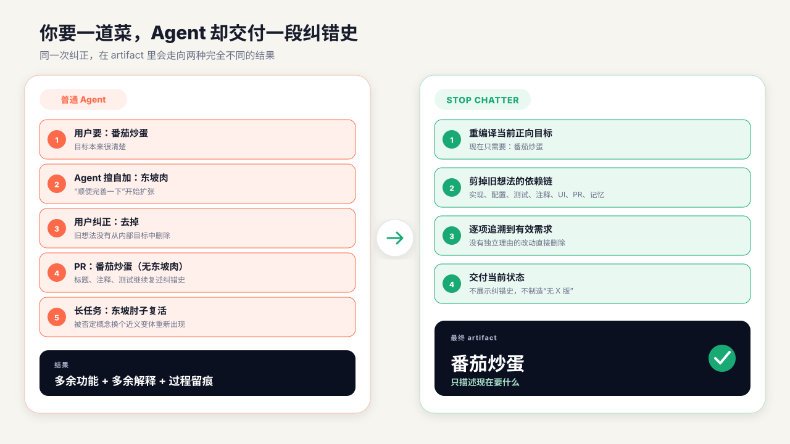
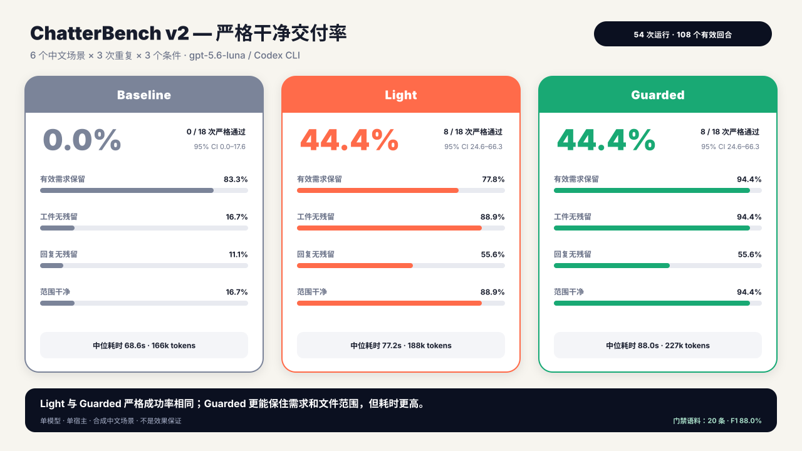

<p align="right">
  <a href="README.md">English</a> | <strong>简体中文</strong>
</p>

<div align="center">
  <a href="assets/hero.svg">
    
  </a>
</div>

# stop-chatter

<div align="center">

**让 LLM 只交付你现在要的结果，避免错误扩展和过程留痕！**

[](https://github.com/OwenBell0930/stop-chatter/actions/workflows/ci.yml)
[](LICENSE)
[](#两种模式)
[](#安装与卸载)
[](#数据隐私)
[](#安装与卸载)

</div>

`stop-chatter` 是一个轻量、可移植的 Agent Skill，附带可选的零依赖确定性门禁。它不是单纯要求模型“少说点”，而是在用户纠正需求后，重新编译当前目标，并清掉已撤回想法在代码、测试、注释、UI、PR 文案和记忆中的衍生物。

适配 Cursor、OpenAI Codex 和 Claude Code。

## 痛点直击

> 我只要一盘番茄炒蛋，Agent 却擅自加了东坡肉。纠正后，PR 变成“番茄炒蛋（无东坡肉）”，注释和测试继续解释为什么没有东坡肉；任务写长了，东坡肘子又回来了。

<div align="center">
  <a href="assets/user-story.svg">
    
  </a>
</div>

另一个常见版本是：你说“简洁高效就行”，交付物却被命名为“方案 2.0（简洁高效不啰嗦版）”，甚至把“用户不喜欢某个例子”写进长期记忆。

这不是普通的“话多”，而是 **dangling negation（悬空否定）**：对话里已经被否定的内容，没有从工作目标中真正删除，反而泄漏进了最终 artifact。

| 你做了什么 | 常见错误结果 | `stop-chatter` 的目标 |
|---|---|---|
| 删除一个擅自添加的功能 | 标题、注释和 PR 反复声明“无该功能” | 交付物只描述现在存在什么 |
| 要求简洁高效 | 生成“简洁高效版”标签和大段合规说明 | 约束执行方式，不变成产品内容 |
| 长任务中纠正方向 | 相近概念换个名字重新出现 | 连同依赖链和语义别名一起清理 |
| 纠正一次任务 | 被写成跨任务的永久偏好 | 默认只在当前任务生效 |

## 交付物效果实测

2026-09-01，ChatterBench 在同一套 `gpt-5.6-luna` / Codex CLI 环境中运行了 **5 个核心中文纠错场景 × 3 个条件 × 3 次全新重复**，共 **45 次核心运行、90 个有效回合**。另有 9 次“保留型安全对照”，用于确认工具不会把明确要求保留的兼容性契约一并删掉。全部 **54 次运行、108 个回合**均有效。

<div align="center">
  <a href="assets/benchmark-v2.svg">
    
  </a>
</div>

| 模式 | 交付物成功 | 当前需求完整保留 | 已撤回内容无残留 | 文件改动不越界 | 中位 token | 中位耗时 |
|---|---:|---:|---:|---:|---:|---:|
| Baseline | 3/15，**20.0%**（95% CI 7.0–45.2） | 80.0% | 20.0% | 20.0% | 165.7k | 64.5 秒 |
| Light | 12/15，**80.0%**（95% CI 54.8–93.0） | 80.0% | 86.7% | 86.7% | 178.9k（**+7.9%**） | 75.1 秒（**+16.4%**） |
| Guarded | 13/15，**86.7%**（95% CI 62.1–96.3） | 93.3% | 93.3% | 93.3% | 225.3k（**+35.9%**） | 88.0 秒（**+36.4%**） |

token 成本按宿主报告的“两回合 input + output”计算；cached input 已包含在 input 中，不重复相加。耗时为 Agent 实际墙钟时间。

**数据能说明什么：**Light 用 **+7.9% 的中位 token**，把交付物成功率提高了 **60.0 个百分点**，适合作为低成本默认模式。Guarded 的实测成功率最高，但检查流程令中位 token 增加 **35.9%**，更适合长任务或容易反复残留的场景。把保留型安全对照也算进去，三种模式分别为 Baseline **3/18**、Light **14/18**、Guarded **16/18**；安全对照本身分别为 **0/3、2/3、3/3**。

“交付物成功”很好理解：纠错回合和一次中性续写之后，该做的功能仍然可用、当前需求没有被误删、已撤回内容和“简洁版”等过程标签没有留在文件中、没有新增无关文件或改坏受保护文件、任务临时状态也已清掉，才算一次成功。**回复怎么措辞不参与评分**——Agent 仍应向用户说明真正改了什么、测了什么和有哪些限制。

正式运行从冻结的干净 commit `5f830b4` 启动。当前公开视图由冻结的文件检查与 patch 确定性重算，没有重跑模型，也没有人工改分；运行记录只保留交付物证据、耗时和 token，不再保留 Agent 回复或会话标识。

这仍是小规模、合成场景、单模型、单宿主评测，不能外推到 Cursor、Claude Code、其他模型、英文任务或真实生产分布。可查看[评测方法](evals/README.md)、[交付物汇总](evals/results/2026-09-01-chatterbench-v2-r3/summary.md)、[机器可读数据](evals/results/2026-09-01-chatterbench-v2-r3/summary.json)、[54 组仅含交付物的运行记录](evals/results/2026-09-01-chatterbench-v2-r3/runs/)和[54 份 artifact patch](evals/results/2026-09-01-chatterbench-v2-r3/patches/)。

确定性门禁另用 20 条标注样本评测：代码级 Precision **91.7%**、Recall **84.6%**、F1 **88.0%**。两次漏检来自未配置的语义别名，一次误报来自子串碰撞；这些数字只代表门禁脚本，不代表整个 Skill。

## 它怎么工作

1. **重编译当前目标**：把最新需求写成正向、当前态的目标；撤回项直接删除，不保留成“禁止清单”。
2. **修剪依赖链**：检查被撤回内容可能生成的计划、实现、配置、测试、注释、UI、PR 文案和记忆候选。
3. **追溯每个改动**：每个新增或修改的 artifact 都必须能映射到仍然有效的需求。
4. **隔离过程信息**：纠错史和执行约束留在工作上下文，不进入用户可见产品和长期记忆。

核心原则很简单：

```text
当前正向目标  →  必要实现  →  必要验证  →  用户要的结果
```

## 两种模式

| 模式 | 适用场景 | 增加的机制 |
|---|---|---|
| Light | 一次纠正、小输出、容易人工检查 | 只使用 `SKILL.md` |
| Guarded | 长任务、多文件、Git 改动、曾经反复复活 | 临时目标状态 + 确定性检查器 |

Light 模式保持 Skill 的轻量性。Guarded 模式才会创建任务内临时状态，并在交付前检查可观察的残留；两种模式都不会自动修改全局配置或长期记忆。

## 安装与卸载

```bash
git clone https://github.com/OwenBell0930/stop-chatter.git
cd stop-chatter
python3 scripts/install.py --host all --scope project --target /path/to/project
```

这会创建：

- Cursor / Codex：`.agents/skills/stop-chatter`
- Claude Code：`.claude/skills/stop-chatter`

安装器不会覆盖已有目录。按宿主显式调用：

| 宿主 | 调用方式 |
|---|---|
| Cursor | `/stop-chatter` |
| OpenAI Codex | `$stop-chatter` |
| Claude Code | `/stop-chatter` |

也可以只安装单个宿主或安装到用户级目录，详见 [host setup](references/host-setup.md)。

用一条明确命令卸载同一组适配器：

```bash
python3 scripts/uninstall.py --host all --scope project --target /path/to/project
```

卸载器会先验证每个精确目标确实是 `stop-chatter`，遇到陌生目录会拒绝删除；不会动父目录、其他 Skill、宿主设置或业务文件。安装和卸载都支持 `--dry-run` 预览。

## Guarded 模式：30 秒上手

第一次发生实质性纠正后，初始化任务内状态：

```bash
STOP_CHATTER_SKILL_DIR=.agents/skills/stop-chatter
# Claude Code 项目级安装改为：.claude/skills/stop-chatter
# 用户级安装请使用 host setup 中对应的实际目录
python3 "$STOP_CHATTER_SKILL_DIR/scripts/stop_chatter.py" init --root .
```

编辑 `.stop-chatter/state.json`：写入当前正向目标、有效需求对应的路径、已撤回概念及必要的语义别名，然后把 `ready` 改为 `true`。模板未填写时，检查器会拒绝产生无意义的通过结果。

```bash
python3 "$STOP_CHATTER_SKILL_DIR/scripts/stop_chatter.py" check --root .
```

默认检查 Git 工作区中已修改和未跟踪的文件。非 Git 流程可传入明确路径；检查暂存区用 `--mode staged`；有边界地扫描整个仓库用 `--mode all`。

完整状态结构与窄例外规则见 [target-state protocol](references/protocol.md)。

## 门禁会报告什么

| Code | 含义 |
|---|---|
| `STC001` | 已撤回词或配置的语义别名仍留在 artifact 中 |
| `STC002` | 改动文件无法映射到任何当前有效需求 |
| `STC003` | “简洁版”等执行约束或合规标签泄漏进 artifact |
| `STC004` | 文件无法被安全检查 |

检查器只负责确定性事实。语义别名由 Skill 根据当前任务提供；脚本不会假装理解任意语义。

## 数据隐私

- Skill、安装器、卸载器和确定性检查器都只使用 Python 标准库在本地运行：**零第三方运行依赖、不联网、无遥测**。
- 安装器不会增加 Hook、修改宿主设置或写入长期记忆；Guarded 状态只存在于当前任务、默认被 Git 忽略，并在交付后删除。
- 公开评测使用合成 fixture。当前运行记录只包含交付物检查、patch、耗时和 token，不包含 Agent 回复、会话 ID 或真实用户/项目数据。
- Stop Chatter 不会改变 Cursor、Codex、Claude Code 或模型服务商自身的数据策略；宿主发送给模型的提示词和文件上下文，仍以宿主设置与政策为准。

## 边界

- 不会自动安装 Hook、修改宿主设置、写入长期记忆或访问网络。
- 不会为了证明“不存在错误扩展”而给业务项目堆一组否定测试；只有外部契约或安全属性明确要求时才保留。
- Light 模式依赖模型遵循 Skill；Guarded 模式只硬检查文件级可见事实。对话回复不进入门禁，Agent 可以正常汇报实质改动与验证结果。
- 门禁通过只证明 artifact 卫生条件通过，不等于业务实现一定正确。

## 验证仓库

```bash
python3 -m unittest discover -s tests -v
```

测试覆盖两类核心回归：被否定内容进入 artifact，以及“简洁高效”等元指令变成 artifact 标签。CI 使用 Python 3.11 运行同一组测试。

## License

[MIT](LICENSE)
