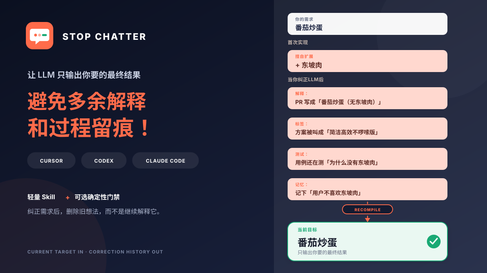
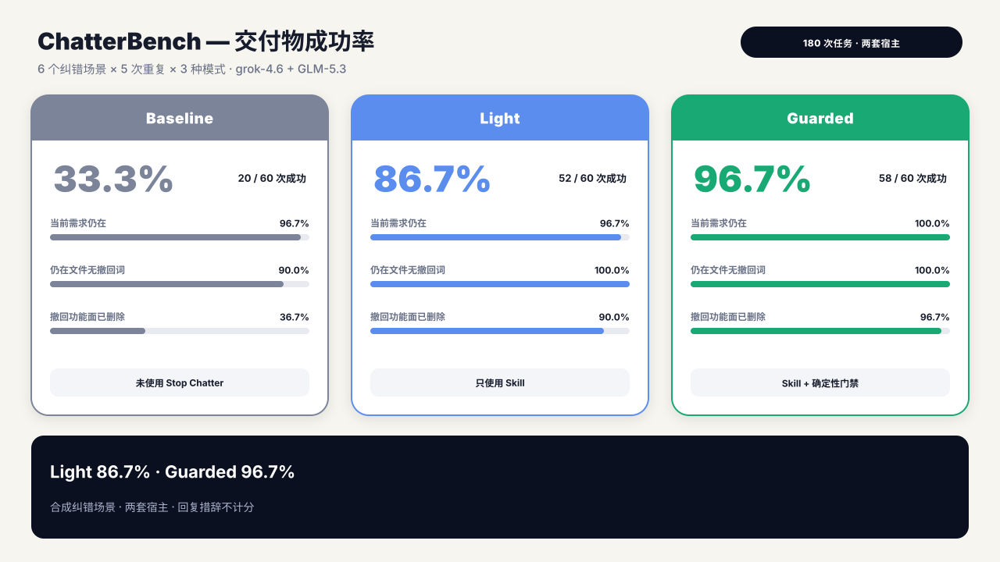
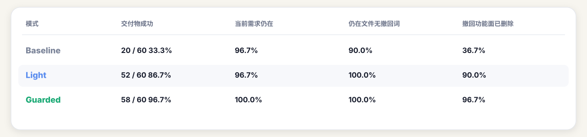

<p align="right">
  <a href="README.md">English</a> | <strong>简体中文</strong>
</p>

<div align="center">
  <a href="assets/cover.svg">
    
  </a>
</div>

# stop-chatter

<div align="center">

**让 LLM 只输出你要的最终结果，避免多余解释和过程留痕！**

[](https://github.com/OwenBell0930/stop-chatter/actions/workflows/ci.yml)
[](LICENSE)
[](#两种模式)
[](#安装与卸载)
[](#数据隐私)
[](#安装与卸载)

</div>

`stop-chatter` 是一个轻量、可移植的 Agent Skill，附带可选的零依赖确定性门禁。它不是单纯要求模型“少说点”，而是在用户纠正需求后，重新编译当前目标，并清掉已撤回想法在代码、测试、注释、UI、PR 文案和记忆中的衍生物。

适配 Cursor、OpenAI Codex 和 Claude Code。

## 痛点直击

> 我只要一盘番茄炒蛋，Agent 却擅自加了东坡肉。纠正后，PR 变成“番茄炒蛋（无东坡肉）”，注释和测试继续解释为什么没有东坡肉；任务写长了，东坡肘子又回来了。

<div align="center">
  <a href="assets/user-story.svg">
    
  </a>
</div>

另一个常见版本是：你说“简洁高效就行”，交付物却被命名为“方案 2.0（简洁高效不啰嗦版）”，甚至把“用户不喜欢某个例子”写进长期记忆。

这不是普通的“话多”，而是 **dangling negation（悬空否定）**：对话里已经被否定的内容，没有从工作目标中真正删除，反而泄漏进了最终 artifact。

<table width="100%">
  <thead>
    <tr>
      <td colspan="3"></td>
    </tr>
    <tr>
      <th align="left">你做了什么</th>
      <th align="left">常见错误结果</th>
      <th align="left"><code>stop-chatter</code> 的目标</th>
    </tr>
  </thead>
  <tbody>
    <tr>
      <td>删除一个擅自添加的功能</td>
      <td>标题、注释和 PR 反复声明“无该功能”</td>
      <td>交付物只描述现在存在什么</td>
    </tr>
    <tr>
      <td>要求简洁高效</td>
      <td>生成“简洁高效版”标签和大段合规说明</td>
      <td>约束执行方式，不变成产品内容</td>
    </tr>
    <tr>
      <td>长任务中纠正方向</td>
      <td>相近概念换个名字重新出现</td>
      <td>连同依赖链和语义别名一起清理</td>
    </tr>
    <tr>
      <td>纠正一次任务</td>
      <td>被写成跨任务的永久偏好</td>
      <td>默认只在当前任务生效</td>
    </tr>
  </tbody>
</table>

## 交付物效果实测

同一套 6 个纠错场景、3 种模式、5 次重复，在 **Grok Build / grok-4.6** 和 **WorkBuddy / GLM-5.3** 上各跑一轮，共 **180 次任务**，每种模式 60 次。纠正后再做一次普通补充，两次都把文件留在当前要的状态，才算成功。

<div align="center">
  <a href="assets/chatterbench.svg">
    
  </a>
</div>

<div>
  
</div>

装上 Skill 之后，交付物成功率从大约三分之一到接近九成；再加上可选门禁，到 96.7%。

“交付物成功”很好理解：当前功能还在、撤回内容和过程措辞不在剩下的文件里、只为撤回项存在的文件已经删掉。**回复怎么写不评分。**

这是合成场景、两套宿主的纠正卫生测量，不是对所有环境或真实任务的保证。评测方法见 [evals/README.md](evals/README.md)。门禁脚本另用 20 条标注样本：Precision **91.7%**、Recall **84.6%**、F1 **88.0%**。

## 它怎么工作

1. **重编译当前目标**：把最新需求写成正向、当前态的目标；撤回项直接删除，不保留成“禁止清单”。
2. **修剪依赖链**：检查被撤回内容可能生成的计划、实现、配置、测试、注释、UI、PR 文案和记忆候选。
3. **追溯每个改动**：每个新增或修改的 artifact 都必须能映射到仍然有效的需求。
4. **隔离过程信息**：纠错史和执行约束留在工作上下文，不进入用户可见产品和长期记忆。

核心原则很简单：

```text
当前正向目标  →  必要实现  →  必要验证  →  用户要的结果
```

## 两种模式

<table width="100%">
  <thead>
    <tr>
      <td colspan="3"></td>
    </tr>
    <tr>
      <th align="left">模式</th>
      <th align="left">适用场景</th>
      <th align="left">增加的机制</th>
    </tr>
  </thead>
  <tbody>
    <tr>
      <td>Light</td>
      <td>普通纠错和后续补充的默认模式</td>
      <td>只使用 <code>SKILL.md</code></td>
    </tr>
    <tr>
      <td>Guarded</td>
      <td>用户明确要求，或同一撤回项已经复发且检查范围能限定</td>
      <td>临时目标状态 + 确定性检查器</td>
    </tr>
  </tbody>
</table>

Light 是默认模式。不要只因为任务长、涉及 Git 或多文件就进入 Guarded。Guarded 模式才会创建任务内临时状态，并在交付前检查已配置的残留；两种模式都不会自动修改全局配置或长期记忆。

## 安装与卸载

```bash
git clone https://github.com/OwenBell0930/stop-chatter.git
cd stop-chatter
python3 scripts/install.py --host all --scope project --target /path/to/project
```

这会创建：

- Cursor / Codex：`.agents/skills/stop-chatter`
- Claude Code：`.claude/skills/stop-chatter`

安装器不会覆盖已有目录。装好后，纠正需求时输入 `/stop-chatter`（Codex 为 `$stop-chatter`）即可。不必每条消息都再选一次；Cursor 也可能在纠正类任务里自动选用。

<table width="100%">
  <thead>
    <tr>
      <td colspan="2"></td>
    </tr>
    <tr>
      <th align="left">宿主</th>
      <th align="left">调用方式</th>
    </tr>
  </thead>
  <tbody>
    <tr>
      <td>Cursor</td>
      <td><code>/stop-chatter</code></td>
    </tr>
    <tr>
      <td>OpenAI Codex</td>
      <td><code>$stop-chatter</code></td>
    </tr>
    <tr>
      <td>Claude Code</td>
      <td><code>/stop-chatter</code></td>
    </tr>
  </tbody>
</table>

也可以只安装单个宿主或安装到用户级目录，详见 [host setup](references/host-setup.md)。

用一条明确命令卸载同一组适配器：

```bash
python3 scripts/uninstall.py --host all --scope project --target /path/to/project
```

卸载器会先验证每个精确目标确实是 `stop-chatter`，遇到陌生目录会拒绝删除；不会动父目录、其他 Skill、宿主设置或业务文件。安装和卸载都支持 `--dry-run` 预览。

## Guarded 模式：30 秒上手

在改交付物之前初始化。如果当前根目录已有有效状态，`init` 会复用它，不会重置开始基线：

```bash
STOP_CHATTER_SKILL_DIR=.agents/skills/stop-chatter
# Claude Code 项目级安装改为：.claude/skills/stop-chatter
# 用户级安装请使用 host setup 中对应的实际目录
python3 "$STOP_CHATTER_SKILL_DIR/scripts/stop_chatter.py" init --root .
```

编辑 `.stop-chatter/state.json`：写入当前正向目标、本轮允许新增/修改的最窄路径、有可见依据才填写的精确 `must_remove` 路径、已撤回概念及必要的语义别名。不要改 init 写入的基线。这些值就绪后再把 `ready` 改为 `true`。模板未填写时，检查器会拒绝产生无意义的通过结果。

```bash
python3 "$STOP_CHATTER_SKILL_DIR/scripts/stop_chatter.py" check --root . --cleanup-state-on-pass
```

默认会把本轮文件操作与任务开始时的 Git 基线比较；`must_remove` 中的路径即使未被改动也会检查是否仍存在。最终检查通过时，同一条命令只删除任务临时状态；检查失败时会保留状态，供一次针对性修复和复检。没有完整基线时，结果会标明有限覆盖，并不会声称已经核实用户原有改动未被覆盖。非 Git 流程可传入明确路径；检查暂存区用 `--mode staged`；有边界地扫描整个仓库用 `--mode all`。

完整状态结构与窄例外规则见 [target-state protocol](references/protocol.md)。

## 门禁会报告什么

<table width="100%">
  <thead>
    <tr>
      <td colspan="2"></td>
    </tr>
    <tr>
      <th align="left">Code</th>
      <th align="left">含义</th>
    </tr>
  </thead>
  <tbody>
    <tr>
      <td><code>STC001</code></td>
      <td>已撤回词或配置的语义别名仍留在 artifact 中</td>
    </tr>
    <tr>
      <td><code>STC002</code></td>
      <td>本轮新增或修改的文件无法映射到任何当前有效需求</td>
    </tr>
    <tr>
      <td><code>STC003</code></td>
      <td>“简洁版”等执行约束或合规标签泄漏进 artifact</td>
    </tr>
    <tr>
      <td><code>STC004</code></td>
      <td>文件无法被安全检查</td>
    </tr>
    <tr>
      <td><code>STC005</code></td>
      <td>删除了未列入 <code>delivery.must_remove</code> 的文件</td>
    </tr>
    <tr>
      <td><code>STC006</code></td>
      <td><code>delivery.must_remove</code> 中的路径仍然存在</td>
    </tr>
  </tbody>
</table>

检查器只负责确定性事实。语义别名由 Skill 根据当前任务提供；脚本不会假装理解任意语义。

## 数据隐私

- Skill、安装器、卸载器和确定性检查器都只使用 Python 标准库在本地运行：**零第三方运行依赖、不联网、无遥测**。
- 安装器不会增加 Hook、修改宿主设置或写入长期记忆；Guarded 状态只存在于当前任务、默认被 Git 忽略，并在交付后删除。
- 公开评测使用合成 fixture。当前运行记录只包含交付物检查、patch 和执行元数据，不包含 Agent 回复、会话 ID 或真实用户/项目数据。
- Stop Chatter 不会改变 Cursor、Codex、Claude Code 或模型服务商自身的数据策略；宿主发送给模型的提示词和文件上下文，仍以宿主设置与政策为准。

## 边界

- 不会自动安装 Hook、修改宿主设置、写入长期记忆或访问网络。
- 不会为了证明“不存在错误扩展”而给业务项目堆一组否定测试；只有外部契约或安全属性明确要求时才保留。
- Light 模式依赖模型遵循 Skill；Guarded 模式只硬检查文件级可见事实。对话回复不进入门禁，Agent 可以正常汇报实质改动与验证结果。
- 门禁通过只证明 artifact 卫生条件通过，不等于业务实现一定正确。

## 验证仓库

```bash
python3 -m unittest discover -s tests -v
```

测试覆盖两类核心回归：被否定内容进入 artifact，以及“简洁高效”等元指令变成 artifact 标签。CI 使用 Python 3.11 运行同一组测试。

## License

[MIT](LICENSE)
